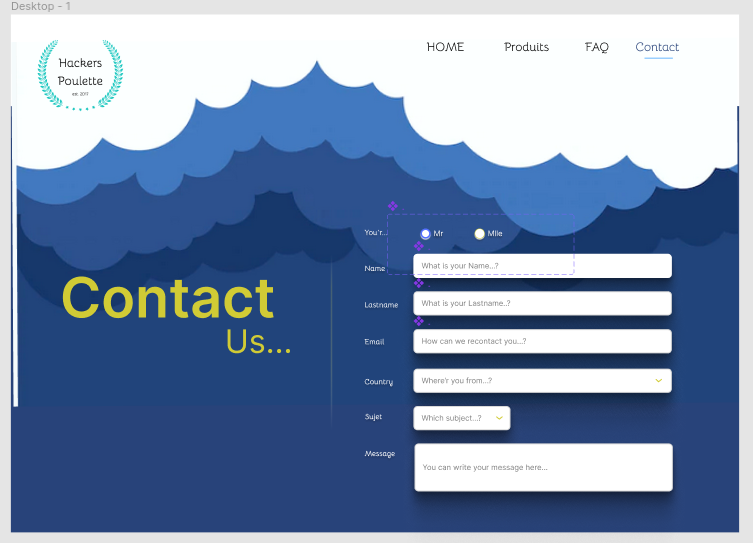

## :rat: I learn.. ☁️

      

# 🐓  Hackers Poulettes

The company Hackers Poulette ™ sells Raspberry Pi accessory kits to build your own. They want to allow their users to contact their support team. Your mission is to create a fully-functioning online "contact support" form, in PHP. It must display a contact form and process the received answer (sanitize, validate, answer the user).

The form should be comprised of:

    name and lastname
    gender
    email address
    country
    subject (3 possibilities)
    message

NOTE: All field, except subject, have to be completed. The field subject takes a default value of Other.

## :art: Figma

## :scream_cat: See the result...

 

{ [Click here :cloud:](http://amoryne.gladion.eu/amoryne/) }
